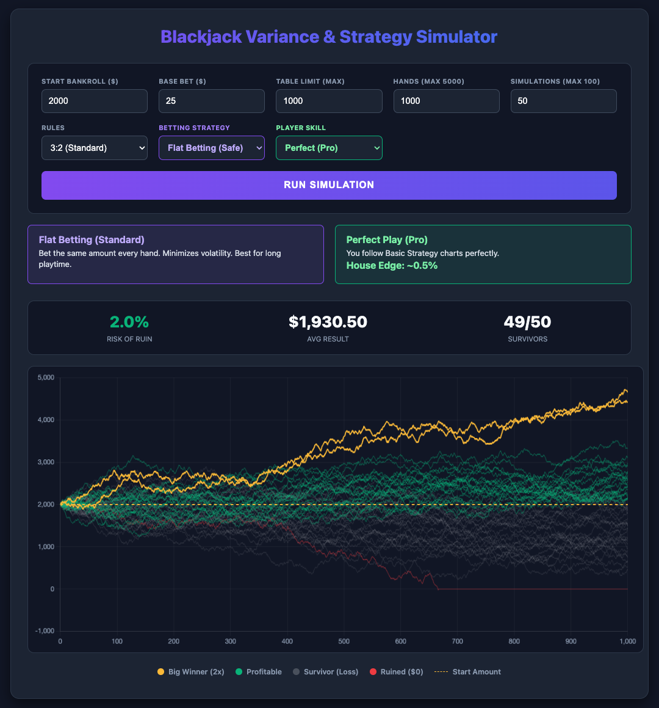

[](https://tjhootman.github.io/blackjack-simulator/)
# Blackjack Variance & Strategy Simulator

A high-performance Single Page Application (SPA) that visualizes the mathematical reality of Blackjack bankroll management.

**Live Demo:** [\[Link to your GitHub Pages\]](https://tjhootman.github.io/blackjack-simulator/)



## 🎯 The Problem
Most Blackjack players understand the "House Edge" (e.g., ~0.5%), but they fail to understand **Variance** and **Risk of Ruin**.

Many players believe betting systems like the **Martingale** (doubling after a loss) are "foolproof." This simulator was built to visually demonstrate:
1.  How **Table Limits** destroy progressive betting systems.
2.  How **Skill Level** (Perfect Basic Strategy vs. Gut Feel) dramatically impacts longevity.
3.  The statistical inevitability of the "Risk of Ruin" over long sessions.

## ⚡ Key Features
* **Real-Time Monte Carlo Simulation:** Simulates up to 100 unique player journeys over 5,000 hands instantly using the browser's local compute.
* **Strategy Engine:** Toggle between 4 distinct betting styles:
    * *Flat Betting* (Control Group)
    * *Martingale* (Negative Progression)
    * *Paroli* (Positive Progression)
    * *D'Alembert* (Balanced Progression)
* **Skill Factor Variable:** Adjusts probability weights based on player skill (Perfect Basic Strategy vs. Average Tourist vs. Poor Play).
* **"Martingale Killer" Logic:** Simulation explicitly enforces Table Maximums to show exactly where and why progressive strategies fail.
* **Data Visualization:** Uses **Chart.js** with optimized rendering (linear scales, dynamic line thickness) to handle dense datasets without lag.
* **Input Safety Clamping:** Logic clamps prevent browser crashes from excessive user inputs (e.g., capping simulations at 100).

## 🛠️ Technical Stack
* **Frontend:** Vanilla HTML5, CSS3 (Modern Flexbox/Grid Layout).
* **Logic:** JavaScript (ES6+) with optimized probability lookup tables to reduce Garbage Collection overhead.
* **Visualization:** [Chart.js](https://www.chartjs.org/) (Canvas API).
* **Deployment:** Static file (Zero dependencies, runs on any server).

## 🧮 How It Works (The Math)
The simulator uses a **Weighted Random Number Generator** rather than simple coin flips. It accounts for the specific payout variance of Blackjack (3:2 vs 6:5 payouts, Double Downs, Pushes).

**House Edge Configuration:**
* **Perfect Play:** ~0.5% Edge (Standard Basic Strategy).
* **Average Play:** ~2.0% Edge (Missed soft doubles/splits).
* **Poor Play:** ~4.0% Edge (Fundamental errors).

## 🚀 Quick Start
No build steps or `npm install` required. This is a lightweight, dependency-free SPA.

1.  Clone the repository:
    ```bash
    git clone [https://github.com/yourusername/casino-simulator.git](https://github.com/yourusername/casino-simulator.git)
    ```
2.  Open `index.html` in any modern web browser.

## 🔮 Future Roadmap
* [ ] **CSV Export:** Allow users to download simulation data for Excel analysis.
* [ ] **Card Counting Toggle:** Implement a "Hi-Lo" system variable that shifts the Edge to the player (+1.0%) to visualize advantage play.
* [ ] **Mobile Optimization:** Further refine the controls grid for small touchscreens.

## ⚖️ Disclaimer
This software is for **educational and entertainment purposes only**. It demonstrates the mathematics of probability and does not guarantee results in real-world gambling. The "Winning Strategies" simulated here (like Martingale) are mathematically proven to fail in the long run due to house edge and table limits. **Gamble responsibly.**

## 📄 License
Distributed under the MIT License. See `LICENSE` for more information.